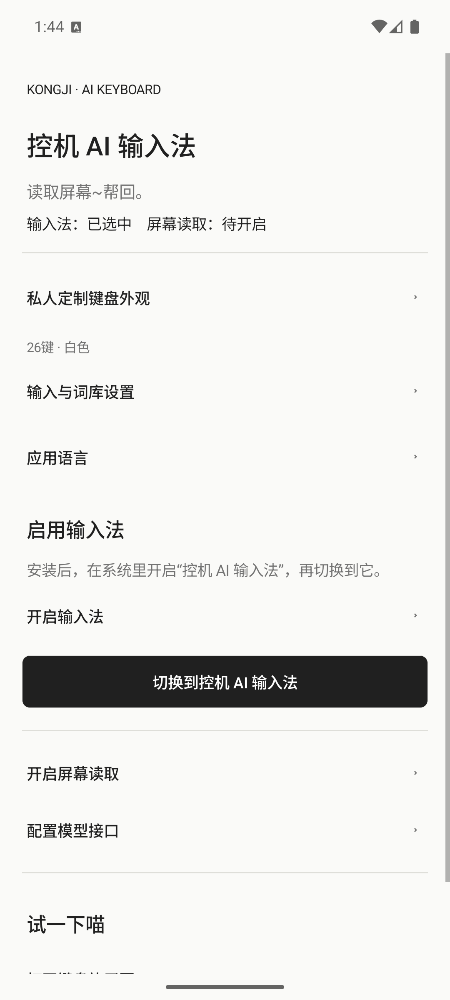
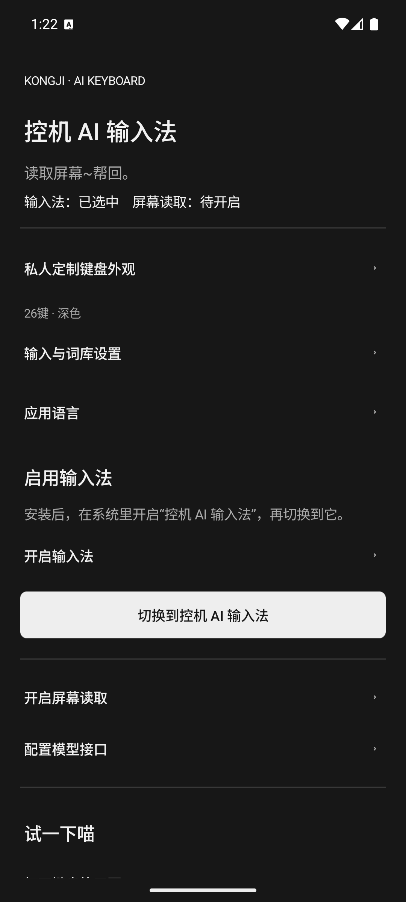
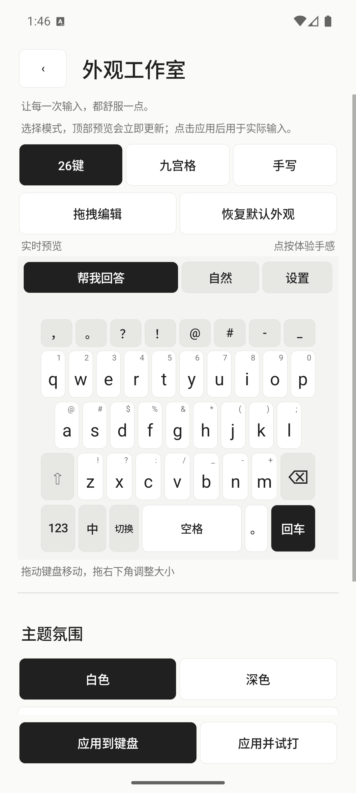
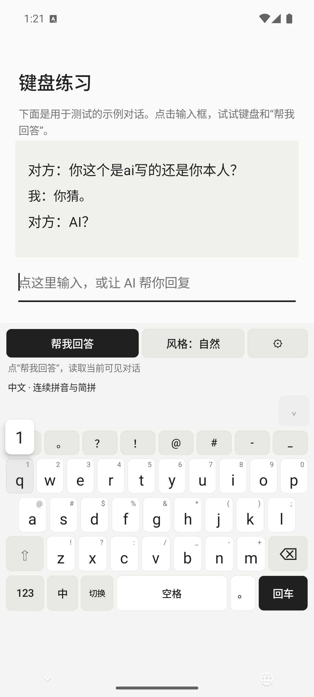
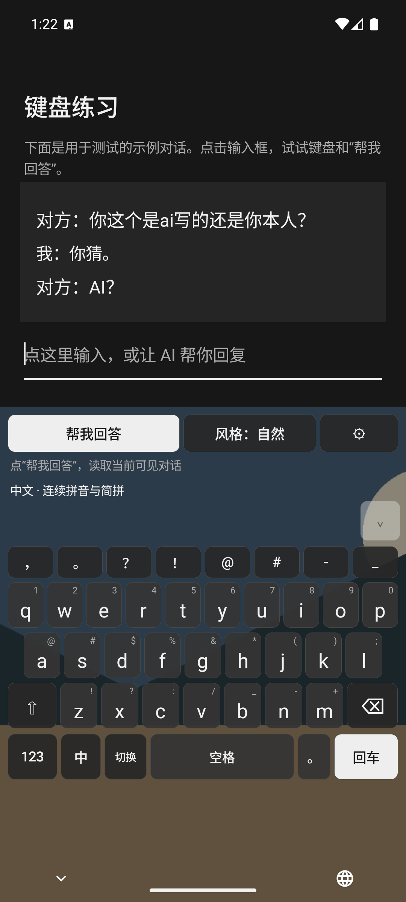
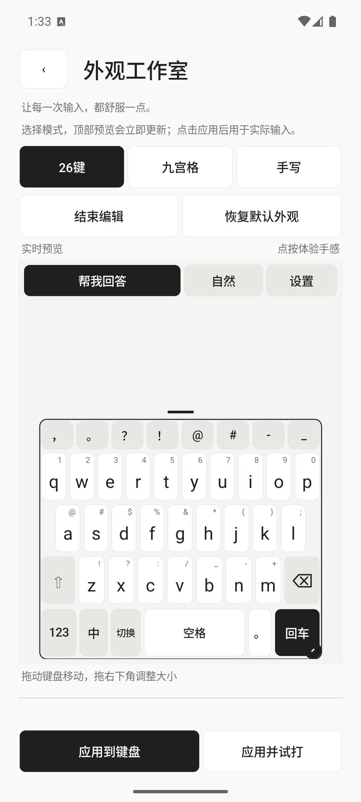
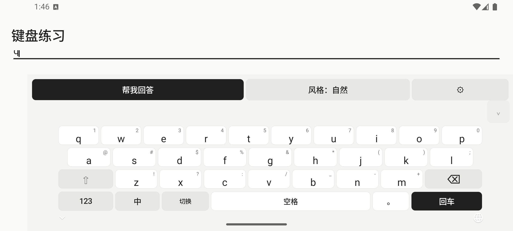

# ⌨️ 控机 AI 输入法 · Kongji AI Keyboard

**AI帮你回！！！！！**

**当前版本：v0.5.0** · **Android 11+** · **Java** · **无需 Root**
有想法可以联系我
qq；3280945089
email：yjjiqpl@qq.com/yjjiqpl@gmail.com

[界面预览](#界面预览) · [这版更新](#v050-更新) · [安装使用](#安装与启用) · [配置 API](#配置模型接口) · [自行编译](#编译项目) · [参与开发](CONTRIBUTING.md)

## 界面预览

📱 以下都是 **v0.5.0 实际运行截图**，来自 Android 36 / Pixel 6 模拟器，不是设计效果图，也不是真机实拍。截图中的聊天为内置练习对话，照片背景使用测试图片。

### 效果截图，可以自定义背景哦~


<table>
  <tr>
    <td align="center"><br /><b>白色首页</b></td>
    <td align="center"><br /><b>深色首页</b></td>
    <td align="center"><br /><b>外观工作室</b></td>
  </tr>
</table>

### 滑动预览、照片背景与拖拽编辑

<table>
  <tr>
    <td align="center"><br /><b>松手确认，小块预览</b></td>
    <td align="center"><br /><b>自己的照片做背景</b></td>
    <td align="center"><br /><b>拖位置，拖角改大小</b></td>
  </tr>
</table>

<details>
<summary>展开查看横屏键盘</summary>

<p align="center">
  
</p>

横屏时使用更紧凑的键盘高度，字母、空格和回车保持在屏幕内。

</details>


## 功能

| 功能 | 能做什么 |
| --- | --- |
| 💬 AI 回复 | 读取当前可见文字和截图，预览确认后调用模型接口，提供回复候选 |
| 🔌 自定义模型接口 | 填写 API 地址、API Key 和模型名称，支持兼容 Chat Completions 的服务 |
| 🇨🇳 中文输入 | 连续拼音组词、简拼、模糊拼音、候选展开、逐词选择，以及有限的拼写纠错 |
| 🔤 英文输入 | 单词补全、拼写纠错候选和后续词推荐 |
| 🧠 本机输入记忆 | 持续保存常用词、选词习惯与前词搭配，可暂停或主动清空 |
| ⌨️ 三种键盘模式 | 26 键、九宫格中文拼音、中文/英文手写；手写模型首次需要下载 |
| 👆 快捷符号 | 快捷符号栏、字母键符号小字、可选上滑/下滑方向与即时预览 |
| 🎨 键盘外观 | 白色/深色主题、照片背景、可拖拽调整位置与大小的实时预览 |
| 🌍 应用语言 | 中文、英语、日语、西班牙语、韩语、德语，以及跟随系统 |

语言设置切换的是**应用界面语言**，不代表支持这些语言的全部输入与词库；当前输入引擎主要面向中文和英文。

## 安装与启用

📦 可以查看仓库的 [Releases 页面](https://github.com/necx26/kongji-ai-keyboard/releases)。若尚未附上 APK，请按后面的步骤自行编译。

本机的最新安装包为 `release/控机AI输入法-v0.5.0.apk`。APK 被 `.gitignore` 忽略，推送源码不会自动把它上传到 Releases。

1. 将 APK 传到手机并安装，按系统提示允许文件管理器安装应用。
2. 打开“控机 AI 输入法”，点击 **开启输入法**，在系统设置中启用它。
3. 返回应用，点击 **切换到控机 AI 输入法**，在列表中选中它。
4. 打开 **键盘练习页**，先试试输入、选词和滑动符号。
5. 如需 AI 回复，再启用 **控机 AI 屏幕读取** 无障碍服务，填写并保存模型接口设置。

只使用普通键盘时，无需配置 API 或开启屏幕读取。部分手机会限制侧载应用的无障碍权限，可能需要在系统“应用信息”中允许受限制的设置。

**已有同签名旧版时直接覆盖安装即可保留输入记忆和配置。卸载应用或清除应用数据会移除本机记录。**

## AI 回复怎么用

```text
点“帮我回答”
    ↓
读取当前可见页面 → 检查预览中的文字和截图
    ↓
点“生成回复” → 选择一条候选 → 填入当前输入框
    ↓
自行检查并发送
```

读取屏幕与向 API 提交内容分为两步。点击 AI 回复候选只会填入文字；回车键遵循所在应用输入框的行为，可能换行、搜索或发送。

## 配置模型接口

在应用的 **配置模型接口** 中填写：

| 设置项 | 填写方式 |
| --- | --- |
| 接口地址 | 服务商基础地址，例如 `https://api.example.com/v1`，或完整的 Chat Completions 地址 |
| API Key | 自己的密钥；免鉴权的本地服务可留空 |
| 模型名称 | 服务商提供的实际模型 ID |
| 允许局域网 HTTP | 连接局域网模型服务时按需开启；默认使用 HTTPS |

程序会在基础地址后补上 `/chat/completions`。上面的示例域名是占位地址，需要替换为自己的服务地址。

**提交截图时，模型必须支持图片输入。** 使用纯文本模型时，在屏幕预览中取消“同时提交截图”；当前页面也需要提供可读取的控件文字。

当前接入的是兼容 Chat Completions 的请求格式。仅提供 Responses、Claude 原生协议或其他私有协议的服务，需要额外适配。

使用电脑上的本地模型服务时，手机与电脑需要能够互相访问，例如 `http://192.168.1.10:8000/v1`。HTTP 选项仅允许私有 IPv4 地址及本机回环地址；手机上的 `localhost` 指手机自身。

## 中文、英文与输入记忆

🧠 记忆保存在本机应用私有数据库中，重新打开应用或覆盖更新后仍会保留，不需要每次重新学习。

| 输入方式 | 示例 |
| --- | --- |
| 连续拼音 | `jintianxiawuwomenqubeijing` 可提供“今天下午我们去北京”等组词候选 |
| 逐词选择 | 选择前面的词后，保留剩余拼音，继续选择后面的词 |
| 简拼 | `nh` 可提供“你好” |
| 隔音符 | `xi'an` 用于区分“西安”和“先” |
| 模糊拼音 | 可分别设置 `zh/z`、`ch/c`、`sh/s`、`an/ang`、`en/eng`、`in/ing` |
| 英文候选 | `hel` 可提供 `hello`，`teh` 可提供 `the`；空格保留原词，点候选替换 |
| 本机记忆 | 根据词频、最近使用和前词搭配调整中文候选排序 |

在 **输入与词库设置** 中可以暂停记忆、添加自定义词语，或清空用户词库与学习记录。中文自定义词语需要填写拼音，例如“控机大师 / kong ji da shi”。

关闭记忆后停止学习，并停用已保存的用户词，已有记录保留至主动清空。密码、网址、邮箱和禁止个性化学习的输入框不参与记忆。

## 定制键盘外观

进入首页的 **外观**，可以边调整边试按键。

1. 选择 **26 键、九宫格或手写**。
2. 点击 **拖拽编辑**，拖动键盘调整位置，拖右下角圆形手柄调整大小。
3. 点击 **结束编辑**，试试当前布局和按键。
4. 选择 **白色 / 深色**；需要照片背景时，点击 **导入照片背景**。
5. 展开 **快捷符号**，选择符号小字位置、上滑或下滑方向。
6. 点击 **应用到键盘** 保存，或 **应用并试打** 进入练习页。

未应用的修改不会覆盖已保存设置。**恢复默认外观** 只恢复尺寸和位置；主题、照片和键盘模式继续保留。**移除照片背景** 只移除应用里的副本，不删除相册原图。照片背景不上传到模型接口。

## 数据与隐私

🔒 普通输入、词库学习和已下载模型的手写识别在本机处理。只有主动生成 AI 回复时，所选屏幕内容才提交到配置的模型接口。

- API Key 使用 Android Keystore 加密保存，不写入应用日志；应用关闭云备份和数据迁移。
- 屏幕读取由点击触发，文字和截图暂存在内存；取消、切换输入目标或隐藏键盘时清理，不保存为文件。
- 密码输入框禁用屏幕读取，受保护页面和系统限制不会被绕过。
- 本机输入记忆可以关闭、清空，不作为普通打字时的 API 请求内容。
- 提交前请检查预览中的姓名、头像和聊天信息；服务商收到内容后的处理方式取决于其规则。

取消请求只能终止本地等待，无法撤回服务商已收到的内容。公开分发 APK 时不要内置多人共用的服务商密钥。

## 编译项目

🔧 本机使用 **JDK 21**，源码语言级别为 **Java 17**。用 Android Studio 打开项目根目录，配置 Android SDK 后同步 Gradle。

| 环境 | 版本 |
| --- | --- |
| 最低 Android 版本 | Android 11 / API 30 |
| compileSdk / targetSdk | 36 / 35 |
| Build Tools | 36.0.0 |
| Android Gradle Plugin | 9.0.0 |
| Gradle Wrapper | 9.3.1，固定下载校验值 |

通过 `ANDROID_HOME` 或本机 `local.properties` 配置 SDK 路径。

Windows PowerShell：

```powershell
.\gradlew.bat :app:assembleDebug :app:lintDebug
```

Linux / macOS：

```bash
chmod +x gradlew
./gradlew :app:assembleDebug :app:lintDebug
```

构建输出为 `app/build/outputs/apk/debug/app-debug.apk`，使用调试签名。

维护者本机也可以运行下面的命令，将版本命名的 APK 放进指定目录。`build.ps1` 默认 Gradle 路径是本机配置，其他电脑需要传入自己的 Gradle 9.3.1 目录。

```powershell
.\build.ps1 -OutputDirectory "D:\控机大师\release"
```

首次构建需要下载 Gradle 和依赖。详细开发与检查方式见 [CONTRIBUTING.md](CONTRIBUTING.md)。

## 项目结构

```text
app/
  src/main/java/com/kongji/aikeyboard/
    AiInputService.java       实际键盘与输入流程
    ChineseEngine.java        中文拼音、组词与候选
    EnglishEngine.java        英文补全与候选
    LearningStore.java        本机输入记忆
    AppearanceActivity.java   外观工作室
    KeyboardFrame.java        拖动、缩放与实际布局
    Glass.java                按键触摸、小预览与逐字删除
    BackgroundPhoto.java      照片导入与本机缓存
    SettingsActivity.java     应用首页与模型设置
  src/main/assets/            词库、界面翻译及许可说明
  src/main/res/               图标、主题和服务配置
docs/                        截图、更新说明与验证记录
tests/                       引擎检查、模拟器脚本与本地 API 测试服务
ui-probe/                    独立的模拟器窗口检查工具
gradle/wrapper/              固定版本的 Gradle 构建入口
build.ps1                    维护者本机的构建与 APK 复制脚本
```

界面主要由 Java 创建。想改排版可以从 `SettingsActivity.java`、`AppearanceActivity.java` 和 `Ui.java` 开始。

## 验证与当前限制

✅ v0.5.0 已完成本机编译与以下检查：

| 检查 | 结果 |
| --- | --- |
| Android Lint | 0 错误、22 条提示 |
| 中文 / 英文输入引擎 | 43 项通过 |
| 独立 SQLite 输入记忆 | 16 项通过 |
| Android 按键事件、布局与照片处理 | 36 项通过 |
| 实际模拟器操作 | 分段验证了滑动、逐字删除、拖拽缩放、照片保存、三种模式与六种界面语言 |

模拟器界面脚本曾受 UiAutomation 崩溃与瞬时树影响中断，上面的界面结果来自分段复测。详情见 [v0.5.0 验证与更新说明](docs/界面与按键体验-v0.5.0.md)。

项目仍在开发中：各品牌真机、微信/QQ、不同 Android 版本、平板与长期连续使用尚未完成全面验证。横屏已在模拟器检查，真机适配仍需继续测试。

本版验证没有调用真实模型 API，不能据此判断模型回复质量。当前没有滑行输入、语音输入或大模型级句意纠错，也尚未完成应用商店发布审核。`tests/mock_api.py` 与 `ui-probe` 不包含在输入法 APK 中。

## 参与开发

🤝 欢迎通过 [Issues](https://github.com/necx26/kongji-ai-keyboard/issues) 提交问题，通过 Pull Request 改进项目。

报告输入问题时，请附上输入序列、预期候选、实际候选、键盘模式及手机型号；界面问题可以附截图。请使用模拟内容，移除真实密钥和私人聊天。

建议流程：**Fork → 新建分支 → 修改与验证 → 提交 PR → 审查与合并**。远程修改合并后，本地可运行：

```powershell
git pull --ff-only origin main
```

GitHub 修改不会自动同步到电脑文件夹，本项目没有后台定时同步。不要提交 `local.properties`、API Key、签名密钥或应用私有数据。更多说明见 [CONTRIBUTING.md](CONTRIBUTING.md)。

## 许可与致谢

- 中文词库：[Rime 袖珍简化字拼音](https://github.com/rime/rime-pinyin-simp)，保留原许可与作者说明。
- 英文词表：[SCOWL / ESDB](https://github.com/en-wl/wordlist)，保留原版权与许可说明。
- 手写识别：Google ML Kit Digital Ink Recognition，当前接入中文和英文模型。
- 布局参考：[HeliBoard](https://github.com/HeliBorg/HeliBoard/wiki/2.-Layouts) 与 [FlorisBoard](https://github.com/florisboard/florisboard)。本项目未复制它们的代码或资源。

完整说明见 [THIRD_PARTY_NOTICES.md](THIRD_PARTY_NOTICES.md)。感谢这些项目提供的词库、工具与设计参考。🙏
